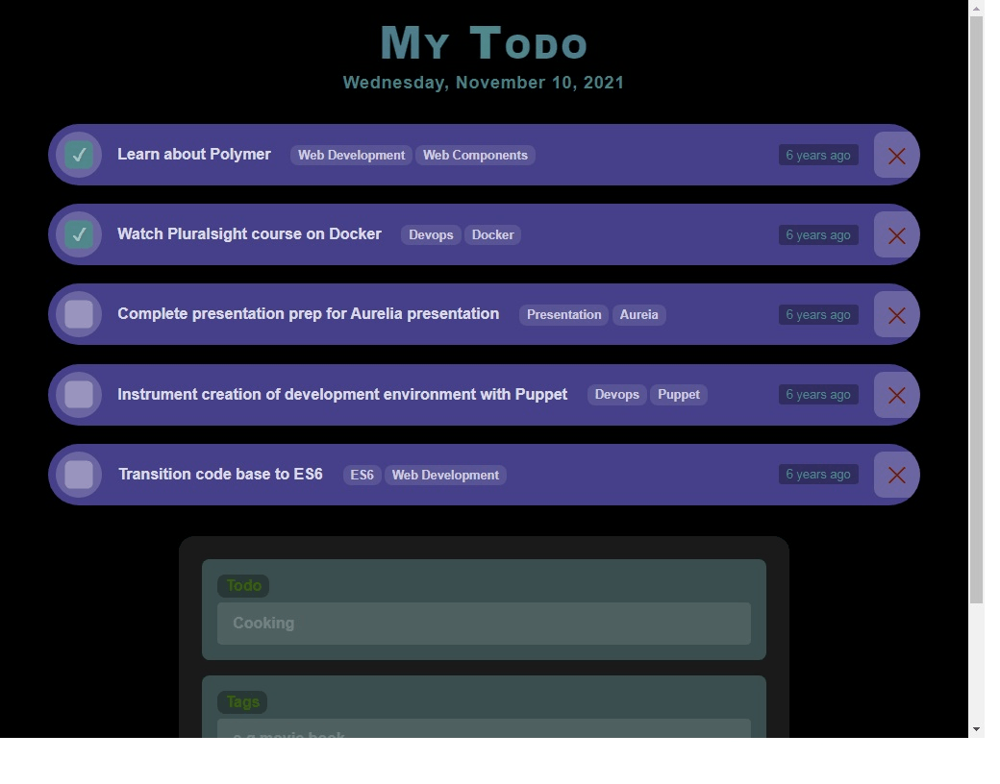

# Rect-Typescript-Styled-TodoList

I have built it as the first project of learning `react` with `typescript` as well as `styled-components`.

**Live** (https://rts-todo.netlify.app/)

### Features

---

- Add Item
- Remove Item
- Update Item
- Add tag/tags (optional)
- Timestamp to add item
- Responsiveness

### Tools

---

- **React** - UI framework for efficient DOM handling
- **Typescript** - static type checking
- **Styled-Components** - styling react component
- **timeago.js** - formatting date human readable format

### UI at a glance

---

